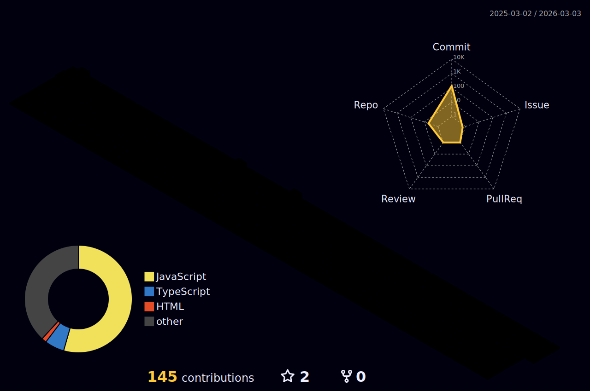

## 프론트엔드 프로그래머 박경일 입니다 🧑‍💻
-----

매순간 실패를 두려워하지 않고 도전적인 삶을 살아가는 것이 저의 목표입니다.

### 🔨 스택

  
  
  

-----

<!--
**pki071120/pki071120** is a ✨ _special_ ✨ repository because its `README.md` (this file) appears on your GitHub profile.

Here are some ideas to get you started:

- 🔭 I’m currently working on ...
- 🌱 I’m currently learning ...
- 👯 I’m looking to collaborate on ...
- 🤔 I’m looking for help with ...
- 💬 Ask me about ...
- 📫 How to reach me: ...
- 😄 Pronouns: ...
- ⚡ Fun fact: ...
-->
